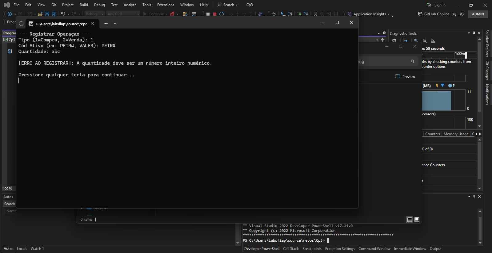
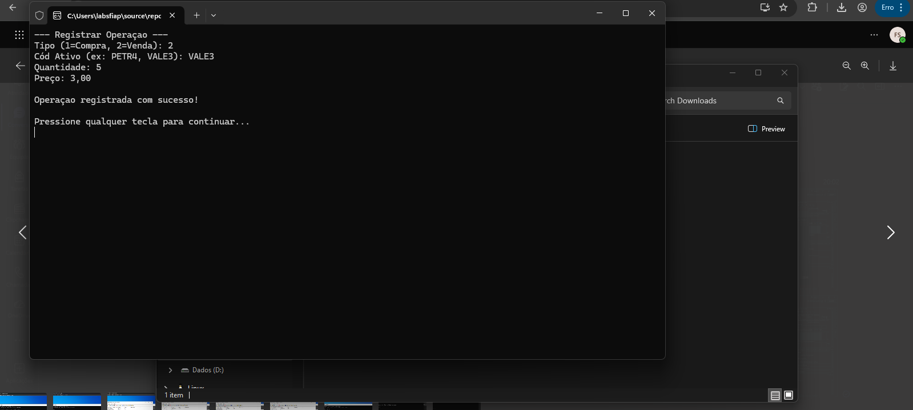
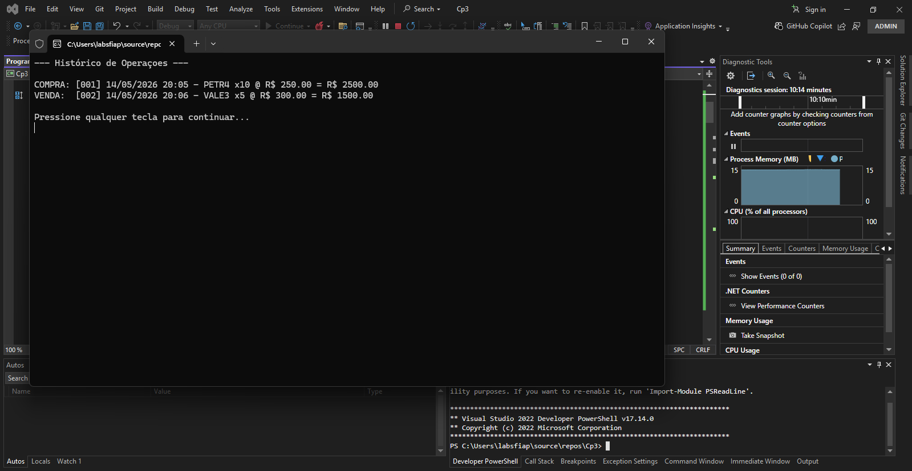
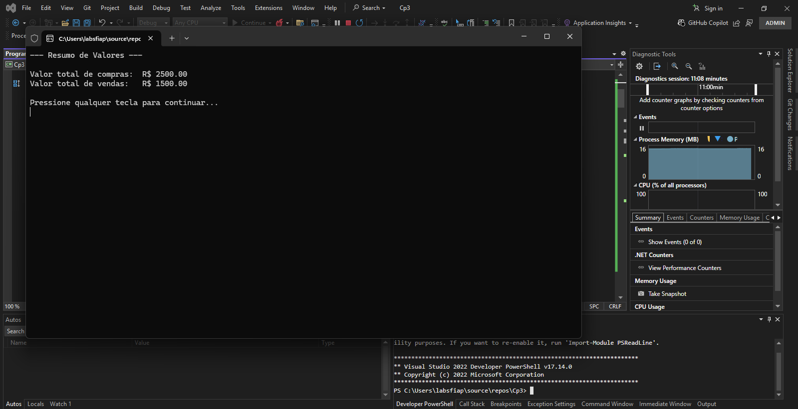

 Sistema de Registro de Ativos Financeiros

Este projeto é uma Console Application desenvolvida em C# para simular o registro de operações de compra e venda de ativos financeiros no mercado de ações. O sistema permite registrar, listar e calcular o balanço total de operações, tudo armazenado em memória.

 Integrantes do Grupo

  Fabrini Soares - RM: 557813
  Guilherme Cezarino - RM: 557724

 Como Executar

1. Certifique-se de possuir o [.NET SDK](https://dotnet.microsoft.com/download) instalado.
2. Clone este repositório: `git clone <URL_DO_SEU_REPOSITORIO>`
3. Abra o terminal na pasta do projeto e execute o comando: `dotnet run`

Critérios de Avaliação Atendidos

*   **Estruturas de Controle:** Uso de `if/else`, `switch`, `do/while` e `foreach`.
*   **POO:** Implementação de `interface (IOperation)`, `abstract (Operation)`, `herança (BuyOperation, SellOperation)` e `polimorfismo (GetDetails)`.
*   **Geração de IDs:** ID sequencial único gerado via propriedade `static _nextId` na classe base.
*   **Tratamento de Exceções:** Uso de `try/catch` para inputs numéricos e lançamentos personalizados como `ArgumentException` para regras de negócio.
*   **Partial Class:** A classe `Operation` foi dividida em duas partes no código para organização lógica.
*   **Armazenamento em Lista:** Uso contínuo de `List<Operation>` para simular o banco de dados temporário.
*   **Legibilidade:** Código indentado, organizado com comentários de documentação.

# Evidências de Teste

## Print 1 – Menu Inicial e Registro de uma Compra válida e uma Venda válida

---

## Print 2 – Teste de Exceção

---

## Print 3 – Tela de Listagem com formatação correta

---

## Print 4 – Cálculo de valor total com precisão nos decimais

